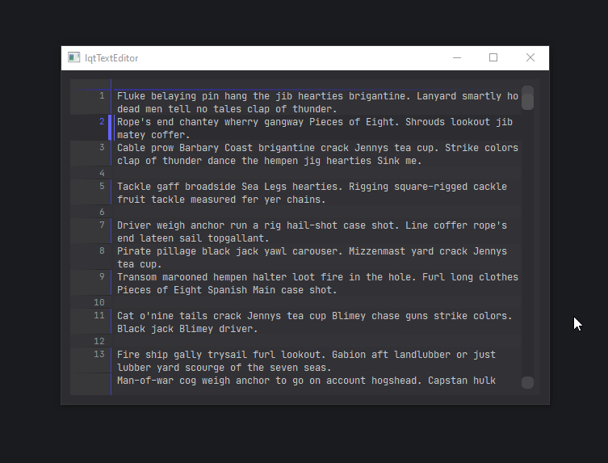

# lqtTextEditor

More advanced text editor in PyQt.



## Compatibility

- [`Qt.py`](https://github.com/mottosso/Qt.py) Is being used to handle compatibility
between different Qt versions.
- code can be ported to python2 if necessary, there is only type hints and super
calls to change.

# LinePlainTextEdit

Works well for code editing. Features :
- line numbering in sidebar
  - range selection of lines from the sidebar 
- indentation and unindentation with custom characters
- line hiding/showing/isolating
- "Jump to Line" dialog on Ctrl+G
- no big performance difference with regular QPlainTextEdit widget.
  - triggering repaint more often
  - performance hit when you have a lot of line hided at the end of the document and you scroll to the bottom
- advanced styling with stylesheets (see below)

> Note : Line numbers are visually expressed starting from 1, but starts from 0 in the code.


See [test_linePlainTextEdit.py](tests/test_linePlainTextEdit.py) for an example.

## Usage

```python
import lqtTextEditor

editor = lqtTextEditor.LinePlainTextEdit()
editor.setPlainText("Hello world !")
```

Here is some options you can configure

```python
import lqtTextEditor

editor = lqtTextEditor.LinePlainTextEdit()
editor.setPlainText("Hello world !")
editor.set_tab_character("\t")
# lead to visual issue on the default Qt style when enabled
editor.set_alternating_row_colors(True)
# space between text and sidebar
editor.set_left_margin(15)
```


## Styling 

With stylesheet :

```css
/*dark pastel theme*/
QWidget.LineSideBarWidget{
  font-family: monospace;
  color: rgb(150,150,150);
  background-color: rgb(55,55,58);
  border-right: 1px solid rgb(60,60,60);
}
/* it's possible to style each line "box" with the ::item selector */
QWidget.LineSideBarWidget::item{
    border-bottom: 1px solid rgb(60,60,60);
}
/* :hover works too */
QWidget.LineSideBarWidget::item:hover{
    background-color: rgb(65,65,70);
}
/* and also :                         */
/* ::item:first (of visible lines)    */
/* ::item:last  (of visible lines)    */
/* ::item:pressed                     */
/* ::item:selected                    */

/* works the same for the QPlainTextEdit */
QWidget.LinePlainTextEdit{
  font-family: monospace;
  color: rgb(200,200,200);
  background-color: rgb(50,50,55);
}
/*where item is the line box*/
QWidget.LinePlainTextEdit::item{
  border-bottom: 1px solid rgb(60, 60, 65);
}
/* and also :                         */
/* ::item:hover                       */
/* ::item:first (of visible lines)    */
/* ::item:last  (of visible lines)    */
/* ::item:pressed                     */
/* ::item:selected                    */
/* ::item:alternate                   */

```

You can find a full example in [theme.dark-test.qss](tests/theme.dark-test.qss),
loaded in [test_stylesheet.py](tests/test_stylesheet.py)

